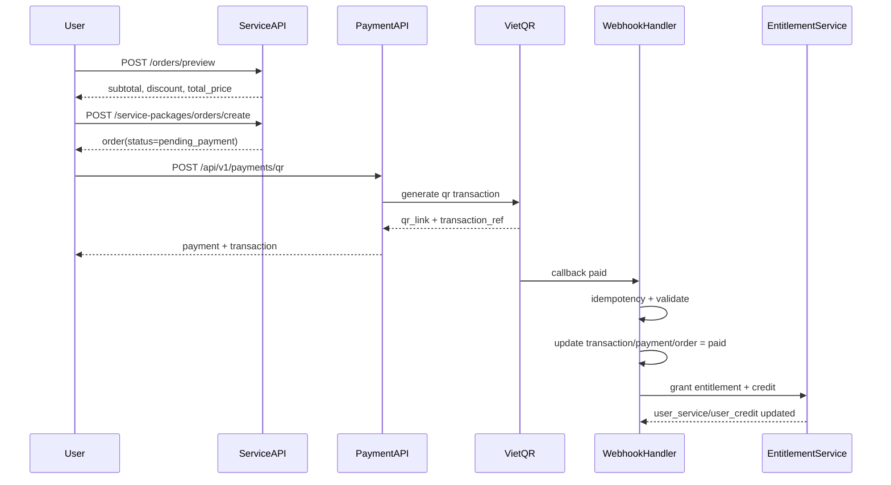
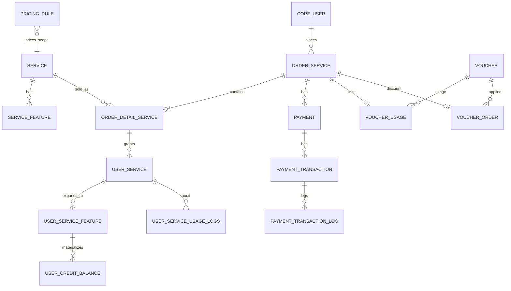

# Báo cáo Kỹ thuật Triển khai Subscription + Payment

## 1) Mục tiêu

Mục tiêu nghiệp vụ:

- Chuẩn hóa miền dữ liệu cho gói dịch vụ, bảng giá, đơn hàng, thanh toán, quyền lợi.
- Hỗ trợ mua gói/nâng cấp/gia hạn với cơ chế tính giá phía server.
- Hỗ trợ retry/cancel đơn hàng khi thanh toán thất bại hoặc hết hạn.
- Hỗ trợ voucher loại single-use/multi-use với kiểm soát trạng thái.
- Hỗ trợ profile paid-flow thông qua cặp trường `is_paid` và `payment_status`.
- Đặt nền cho quản trị doanh thu và kiểm soát quyền lợi theo credit pool.

Phạm vi: **Backend**.

---

## 2) Kiến trúc nghiệp vụ tổng thể (As-Implemented)

```mermaid
flowchart LR
    adminConfig[AdminConfigAndPricingRule] --> catalog[ServiceCatalog]
    catalog --> previewOrder[OrderPreviewServerPricing]
    previewOrder --> createOrder[CreateOrderPendingPayment]
    createOrder --> createQr[CreatePaymentQR]
    createQr --> paymentGateway[VietQRGateway]
    paymentGateway --> callback[VietQRCallback]
    callback --> updateState[UpdatePaymentAndOrderState]
    updateState --> grantEntitlement[GrantUserEntitlement]
    grantEntitlement --> buildCredit[BuildCreditPool]
    buildCredit --> usageLedger[UsageLedgerAndAudit]
    updateState --> markProfilePaid[MarkProfileUpdateRequestPaid]
```

### Diễn giải kiến trúc

- **Lớp Catalog + Pricing**: định nghĩa gói, quyền lợi, bảng giá theo scope/cycle/target.
- **Lớp Order Engine**: tạo order idempotent, lưu thông tin scope áp dụng (account/profile/listing).
- **Lớp Payment Engine**: tạo payment transaction qua VietQR, xử lý callback theo nguyên tắc idempotent.
- **Lớp Entitlement Engine**: khi order paid, cấp `UserService` và phân rã thành quyền lợi chi tiết.
- **Lớp Credit Pool + Ledger**: chuyển quyền lợi sang số dư consumable và ghi nhật ký nghiệp vụ.
- **Lớp Profile Paid Flow**: đồng bộ trạng thái thanh toán của các yêu cầu cập nhật hồ sơ đã duyệt.

---

## 3) Sequence luồng giao dịch chính

---

## 4) Mô hình dữ liệu Subscription/Payment (ER)

---

## 5) Chi tiết thay đổi schema và ý nghĩa nghiệp vụ

## 5.1 Nhóm Service (`src/service/models.py`)

### A. Bảng `Service` (mở rộng)

**Field mới/chỉnh sửa chính**

- `code`: mã định danh nghiệp vụ của gói/dịch vụ.
- `target_type`: đối tượng áp dụng (phòng khám, bác sĩ, chợ y tế, account...).
- `description`: mô tả nghiệp vụ của gói.
- `billing_unit`: đơn vị thời hạn (`day|month`).
- `entitlement_mode`: cách phân quyền lợi (`aggregate|monthly_bucket|credit_pool`).
- `purchase_policy`: chính sách mua chồng (`allow_parallel|...`).
- `is_stackable`: có cho cộng dồn hay không.

**Ý nghĩa**

- Tách rõ “định nghĩa sản phẩm” khỏi “giao dịch mua”.
- Cho phép admin cấu hình linh hoạt theo từng loại đối tượng và chính sách quyền lợi.

---

### B. Bảng `PricingRule` (mới)

**Mục đích**

- Biểu diễn ma trận giá để server tính tiền chuẩn.
- Không phụ thuộc giá FE gửi lên.

**Trường cốt lõi**

- `scope`: loại giá (`POSTING_FEE`, `RENEWAL_FEE`, `PACKAGE_PRICE`, `EXTRA_UNIT_PRICE`).
- `target_type`: đối tượng tính giá.
- `cycle`: kỳ giá (`MONTH`, `QUARTER`, `YEAR`, `DAYS_30`...).
- `amount`, `currency`, `starts_at`, `ends_at`, `is_active`.
- `metadata`: dữ liệu mở rộng.

---

### C. Bảng `ServiceFeature` (mở rộng)

**Field mới**

- `reset_policy`: reset tháng hay cộng dồn.
- `expires_with_entitlement`: quyền lợi hết theo entitlement hay không.
- `extra_unit_price`: đơn giá phát sinh cho feature.

**Ý nghĩa**

- Hỗ trợ case quyền lợi theo tháng/credit pool.
- Hỗ trợ tính phí phát sinh ảnh, video, dịch vụ trong tin.

---

### D. Bảng `OrderService`

**Trạng thái mới**

- `draft`
- `pending_payment`
- `paid`
- `failed`
- `canceled`
- `expired`

**Field mới**

- `code`: mã đơn.
- `idempotency_key`: chống tạo trùng đơn.
- `currency`, `payment_due_at`, `canceled_reason`, `metadata`.

**Ý nghĩa**

- Chuẩn hóa vòng đời đơn hàng để phục vụ retry/cancel, đối soát và báo cáo doanh thu.

---

### E. Bảng `OrderDetailService` (mở rộng scope áp dụng)

**Field mới**

- `unit_price`, `quantity`, `duration`, `duration_unit`.
- `scope_type`: `account|profile|listing`.
- `target_type`, `target_id`.
- `metadata`.

**Ý nghĩa**

- Cho phép một đơn áp dụng cho toàn tài khoản hoặc một profile/tin đăng cụ thể.
- Là nền cho luồng “đăng hồ sơ trả phí” và “gia hạn theo đối tượng”.

---

### F. Bảng `UserService` (entitlement)

**Field mới**

- `status`: `scheduled|active|exhausted|expired|canceled`.
- `activation_source`.
- `scope_type`, `scope_ref_id`.
- `scheduled_start_at`, `canceled_at`.

**Ý nghĩa**

- Hỗ trợ kích hoạt quyền lợi có điều kiện (ví dụ đợi hồ sơ duyệt rồi mới tính hạn).
- Hỗ trợ cộng dồn thời gian và quản lý trạng thái entitlement rõ ràng.

---

### G. Bảng `UserServiceFeature` (mở rộng)

**Field mới**

- `quantity_allocated`, `quantity_remaining`, `expires_at`, `metadata`.

**Ý nghĩa**

- Theo dõi đầy đủ cấp phát/tiêu hao quyền lợi theo feature.

---

### H. Bảng `UserCreditBalance` (mới)

**Vai trò**

- Vùng số dư credit có thể tiêu hao.

**Field chính**

- `user`, `feature_type`, `quantity_remaining`, `expires_at`, `source_user_service_feature`.

**Ý nghĩa**

- Cơ sở để áp dụng chiến lược tiêu hao FEFO (hết hạn sớm trừ trước).

---

### I. Bảng `UserServiceUsageLogs` (mở rộng)

**Field mới**

- `action`: `allocate|reserve|consume|release|expire|cancel`.
- `idempotency_key`, `metadata`.

**Ý nghĩa**

- Đóng vai trò sổ cái nghiệp vụ (audit trail) cho việc cấp/trừ quyền lợi.

---

## 5.2 Nhóm Payment (`src/payment/models.py`)

### A. Bảng `Payment` (mở rộng)

- Thêm `provider`, `idempotency_key`, `external_ref`, `metadata`.
- Bổ sung index cho `order/status`, `idempotency_key`, `external_ref`.

**Ý nghĩa**: sẵn sàng đa cổng thanh toán, chống tạo giao dịch lặp và tăng khả năng đối soát.

### B. Bảng `PaymentTransaction` (mở rộng)

- Thêm `idempotency_key`, `metadata`.
- Bổ sung index `payment/status`, `idempotency_key`.

**Ý nghĩa**: hỗ trợ xử lý callback an toàn, giảm rủi ro duplicate transaction.

---

## 5.3 Nhóm Voucher (`src/voucher/models.py`)

### Bảng `Voucher` (điều chỉnh)

- `code` cho phép rỗng và tự sinh nếu admin không nhập.

**Ý nghĩa**: đáp ứng nghiệp vụ tạo voucher thủ công hoặc auto-generate mã.

---

## 5.4 Profile paid-flow

### `DoctorProfileUpdateRequest` (`src/doctor/models.py`)

- Bổ sung `is_paid` và `payment_status`.

### `MedicalFacilityProfileUpdateRequest` (`src/facility/models.py`)

- Bổ sung `is_paid` và `payment_status`.

**Ý nghĩa**: xác định chính xác những khối cập nhật hồ sơ đã thanh toán hay chưa trước khi công khai.

---

## 6) API contract

Base URL: `api/v1/service/`

### Catalog/Pricing

- `GET /catalog`: lấy service catalog + pricing rules.
- `GET /service-packages/`: danh sách package đang active.
- `GET /service-packages/{id}`: chi tiết package.

### Order

- `POST /orders/preview`: tính giá server-side (hỗ trợ voucher).
- `POST /service-packages/orders/create`: tạo order trạng thái `pending_payment`.
- `GET /service-packages/orders/pending`: truy vấn pending order theo service/duration.
- `GET /orders`: danh sách đơn hàng theo user.
- `GET /orders/{id}`: chi tiết đơn hàng.
- `POST /orders/{id}/retry`: chuyển đơn `failed/expired` về `pending_payment`.
- `POST /orders/{id}/cancel`: hủy đơn (nếu trạng thái cho phép).

### Payment history / Entitlement

- `GET /transactions/history`
- `GET /payments/history`
- `GET /entitlements`
- `GET /credits`
- `GET /profile-payables` (các update profile approved nhưng chưa paid)

### Payment gateway

- `POST /api/v1/payments/qr`: tạo QR thanh toán (yêu cầu auth, kiểm tra owner order).
- `POST /vqr/bank/api/transaction-sync`: webhook cập nhật `transaction/payment/order` theo idempotent logic.

---
