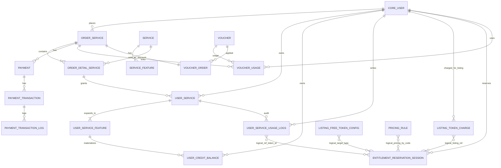
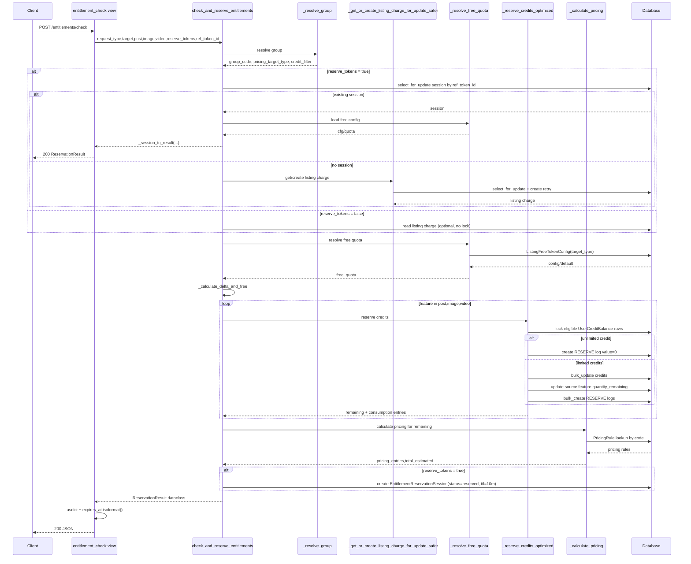
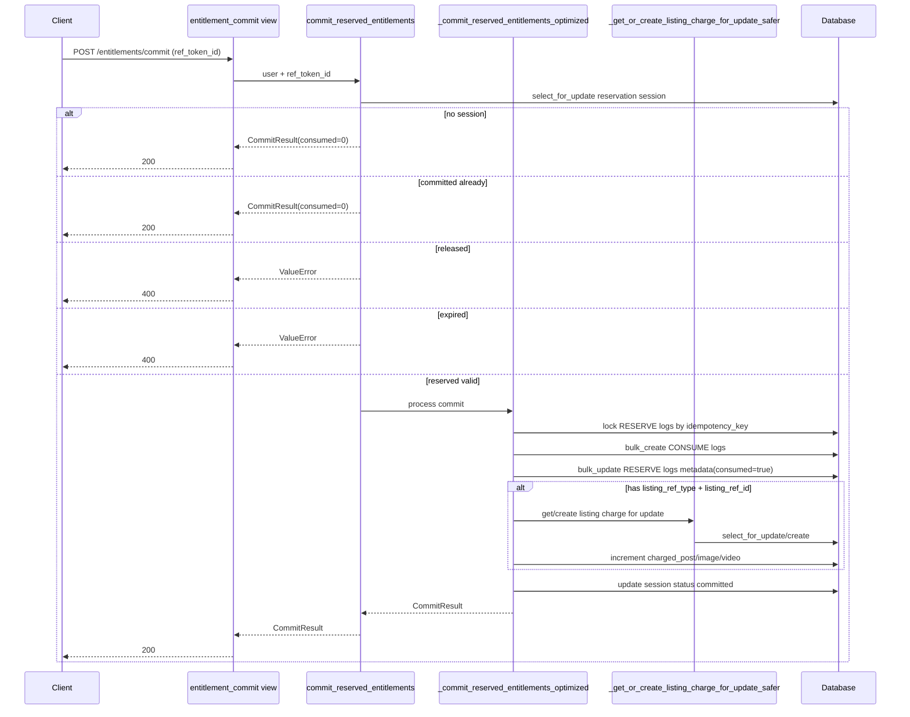
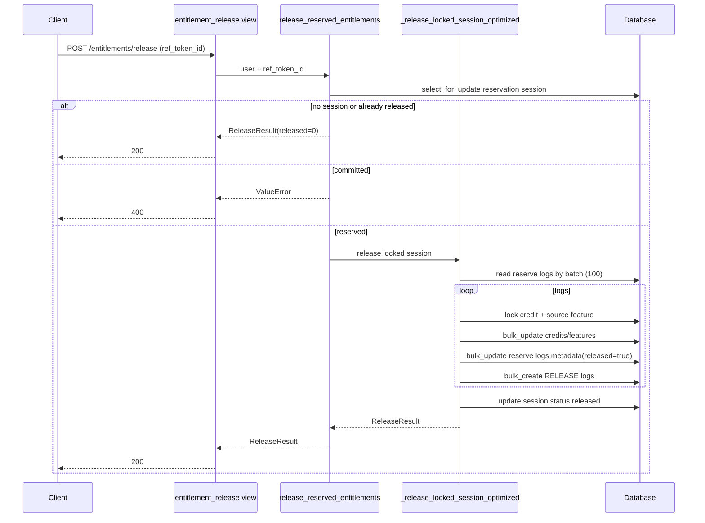
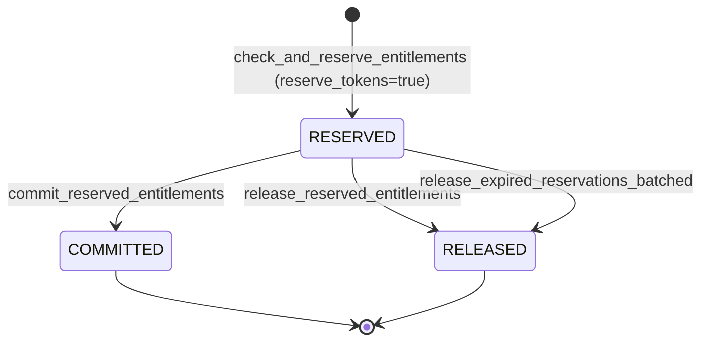
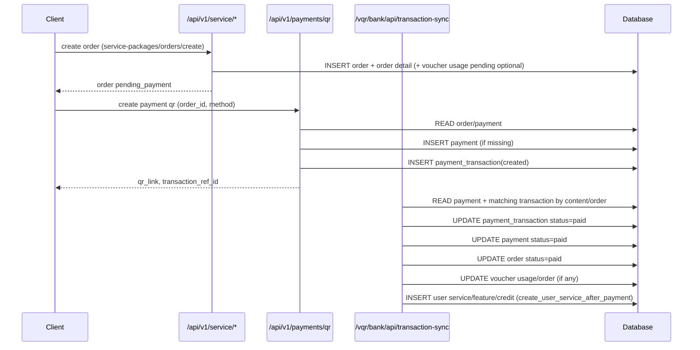

# Subscription / Entitlement Technical Spec

## 1) Scope và endpoint

Base API prefix:

- `/api/v1/service`

Entitlement endpoints:

- `POST /api/v1/service/entitlements/check`
- `POST /api/v1/service/entitlements/commit`
- `POST /api/v1/service/entitlements/release`

Supporting endpoints:

- `GET /api/v1/service/entitlements`
- `GET /api/v1/service/credits`

## 2) Constants và naming chuẩn hệ thống hiện tại

### 2.1 TargetType hợp lệ (theo `Service.TargetType`)

- `CLINIC`
- `LAB_TEST`
- `DIAGNOSTIC`
- `DENTAL`
- `TRADITIONAL_MEDICINE`
- `PHARMACY`
- `AMBULANCE`
- `DOCTOR`
- `NURSE`
- `MEDICAL_MARKET`
- `PHARMA_MARKET`
- `JOB`
- `SOCIAL`
- `HOUSING_SHARE`
- `PARTNERSHIP`
- `HEALTHCARE_STAFF`
- `ACCOUNT`

### 2.2 Group resolution (theo `_resolve_group`)

- **Community group** (`PARTNERSHIP`, `HOUSING_SHARE`, `SOCIAL`, `JOB`, `PHARMA_MARKET`, `MEDICAL_MARKET`)
  - `group_code = COMMUNITY`
  - `pricing_target_type = type`
  - `credit_filter` theo package codes: `PKG_STANDARD|PKG_PROFESSIONAL|PKG_VIP`

- **Healthcare staff group** (`HEALTHCARE_STAFF`)
  - `pricing_target_type = target || DOCTOR`
  - `group_code = SPECIAL_HEALTHCARE_STAFF_<pricing_target_type>`
  - `credit_filter`: target_type in `[HEALTHCARE_STAFF, pricing_target_type]`

- **Specialized group** (`HEALTHCARE_STAFF`, `CLINIC`, `LAB_TEST`, `DIAGNOSTIC`, `DENTAL`, `TRADITIONAL_MEDICINE`, `PHARMACY`, `AMBULANCE`)
  - `group_code = SPECIAL_<type>`
  - `pricing_target_type = type`

- **Default group**
  - `group_code = GENERAL_<type_or_UNKNOWN>`
  - `pricing_target_type = type || ACCOUNT`

### 2.3 Pricing code mapping (theo service + fixture SQL)

Theo implementation:

- post: `POSTING_FEE_30_DAYS_<pricing_target_type>`
- image: `EXTRA_IMAGE`
- video: `EXTRA_VIDEO`

Theo fixture `service_subscription_catalog.sql`, dữ liệu seed đang có:

- posting fee:
  - `POSTING_FEE_30_DAYS_CLINIC`
  - `POSTING_FEE_30_DAYS_LAB_TEST`
  - `POSTING_FEE_30_DAYS_DIAGNOSTIC`
  - `POSTING_FEE_30_DAYS_DENTAL`
  - `POSTING_FEE_30_DAYS_TRADITIONAL_MEDICINE`
  - `POSTING_FEE_30_DAYS_PHARMACY`
  - `POSTING_FEE_30_DAYS_AMBULANCE`
  - `POSTING_FEE_30_DAYS_DOCTOR`
  - `POSTING_FEE_30_DAYS_NURSE`
  - `POSTING_FEE_30_DAYS_MEDICAL_MARKET`
  - `POSTING_FEE_30_DAYS_PHARMA_MARKET`
  - `POSTING_FEE_30_DAYS_JOB`
  - `POSTING_FEE_30_DAYS_SOCIAL`
  - `POSTING_FEE_30_DAYS_HOUSING_SHARE`
  - `POSTING_FEE_30_DAYS_PARTNERSHIP`
- extra:
  - `EXTRA_IMAGE`
  - `EXTRA_VIDEO`
  - `EXTRA_POSTING_SERVICE` (hiện flow entitlement chưa tính posting_service trong reserve/check response)

## 3) Mô hình dữ liệu Subscription/Payment (ER)



Ghi chú quan trọng:

- Các cạnh ở nhóm `Logical (non-FK)` là quan hệ nghiệp vụ theo `target_type`, `listing_ref_type/listing_ref_id`, `ref_token_id` hoặc pricing code; **không phải** foreign key cứng ở DB.
- `PRICING_RULE` hiện không có FK trực tiếp sang `SERVICE`; việc lookup giá được thực hiện bằng `code` trong service entitlement (`POSTING_FEE_30_DAYS_<target>`, `EXTRA_IMAGE`, `EXTRA_VIDEO`).

## 4) Data Dictionary (bảng + ý nghĩa từng field)

Phạm vi bên dưới bao gồm toàn bộ bảng liên quan trực tiếp đến Subscription/Entitlement/Payment/Voucher trong flow hiện tại.

### 4.1 `service_service` (Service)

Mục đích:

- Danh mục dịch vụ/gói dịch vụ gốc để bán và cấp entitlement.

Field:

- `id`: khóa chính.
- `code`: mã dịch vụ duy nhất (ví dụ `PKG_STANDARD`).
- `type`: loại dịch vụ (`VIP`, `profile`, `posting`, `general`).
- `target_type`: phạm vi target áp dụng của dịch vụ.
- `name`: tên hiển thị dịch vụ.
- `description`: mô tả chi tiết.
- `price`: giá đơn vị niêm yết.
- `duration`: thời lượng hiệu lực theo `billing_unit`.
- `billing_unit`: đơn vị tính thời gian (`day`, `month`).
- `entitlement_mode`: cách cấp quyền lợi (`aggregate`, `monthly_bucket`, `credit_pool`).
- `purchase_policy`: chính sách mua.
- `is_stackable`: có cho cộng dồn hay không.
- `is_active`: trạng thái hoạt động.
- `created_at`: thời điểm tạo.
- `updated_at`: thời điểm cập nhật.

### 4.2 `service_servicefeature` (ServiceFeature)

Mục đích:

- Định nghĩa entitlement feature được đóng gói trong `service_service`.

Field:

- `id`: khóa chính.
- `service_id`: FK tới `service_service`.
- `type`: loại feature (`post`, `image`, `video`, `posting_service`).
- `quantity`: quota cấp phát (`NULL` = unlimited).
- `description`: mô tả feature.
- `reset_policy`: chính sách reset quota.
- `expires_with_entitlement`: feature có hết hạn theo entitlement hay không.
- `extra_unit_price`: đơn giá phát sinh cho feature (nếu có).
- `is_active`: trạng thái kích hoạt.
- `created_at`: thời điểm tạo.
- `updated_at`: thời điểm cập nhật.

### 4.3 `service_pricingrule` (PricingRule)

Mục đích:

- Bảng giá chuẩn cho posting fee/renewal/extra unit price.

Field:

- `id`: khóa chính.
- `code`: mã rule duy nhất (lookup theo code trong flow).
- `scope`: nhóm giá (`POSTING_FEE`, `RENEWAL_FEE`, `PACKAGE_PRICE`, `EXTRA_UNIT_PRICE`).
- `target_type`: target mà rule áp dụng.
- `cycle`: chu kỳ giá (`ONE_TIME`, `DAYS_30`, `MONTH`, ...).
- `amount`: đơn giá.
- `currency`: đơn vị tiền tệ (thường `VND`).
- `metadata`: metadata linh hoạt.
- `is_active`: cờ kích hoạt.
- `starts_at`: thời điểm bắt đầu hiệu lực.
- `ends_at`: thời điểm kết thúc hiệu lực (nullable).
- `created_at`: thời điểm tạo.
- `updated_at`: thời điểm cập nhật.

### 4.4 `service_orderservice` (OrderService)

Mục đích:

- Header của đơn hàng dịch vụ.

Field:

- `id`: khóa chính.
- `user_id`: FK tới `core_user`.
- `code`: mã đơn hàng.
- `idempotency_key`: khóa idempotency khi tạo đơn.
- `total_price`: tổng tiền đơn.
- `currency`: tiền tệ.
- `status`: trạng thái đơn (`draft`, `pending_payment`, `paid`, `failed`, `canceled`, `expired`).
- `payment_due_at`: hạn thanh toán.
- `canceled_reason`: lý do hủy.
- `metadata`: dữ liệu mở rộng (ví dụ voucher code).
- `created_at`: thời điểm tạo.
- `updated_at`: thời điểm cập nhật.

### 4.5 `service_orderdetailservice` (OrderDetailService)

Mục đích:

- Dòng chi tiết sản phẩm dịch vụ trong đơn hàng.

Field:

- `id`: khóa chính.
- `service_id`: FK tới `service_service`.
- `order_id`: FK tới `service_orderservice`.
- `price`: thành tiền dòng.
- `unit_price`: đơn giá tại thời điểm mua.
- `quantity`: số lượng.
- `duration`: thời hạn dòng dịch vụ.
- `duration_unit`: đơn vị thời hạn.
- `scope_type`: phạm vi cấp quyền lợi (`account`, `profile`, `listing`).
- `target_type`: target áp dụng dòng dịch vụ.
- `target_id`: id target cụ thể (nullable).
- `metadata`: dữ liệu mở rộng.
- `created_at`: thời điểm tạo.
- `updated_at`: thời điểm cập nhật.

### 4.6 `service_userservice` (UserService)

Mục đích:

- Bản ghi entitlement đã cấp cho user sau thanh toán.

Field:

- `id`: khóa chính.
- `user_id`: FK tới `core_user`.
- `order_detail_service_id`: FK tới `service_orderdetailservice`.
- `scope_type`: phạm vi entitlement.
- `scope_ref_id`: id thực thể phạm vi (nullable).
- `activation_source`: cách kích hoạt entitlement.
- `status`: trạng thái entitlement (`scheduled`, `active`, `exhausted`, `expired`, `canceled`).
- `start_date`: thời điểm bắt đầu hiệu lực.
- `end_date`: thời điểm kết thúc hiệu lực.
- `scheduled_start_at`: thời điểm dự kiến kích hoạt.
- `canceled_at`: thời điểm hủy.
- `is_active`: cờ active nhanh.
- `created_at`: thời điểm tạo.
- `updated_at`: thời điểm cập nhật.

### 4.7 `service_userservicefeature` (UserServiceFeature)

Mục đích:

- Chi tiết quota feature thực tế user nhận từ `UserService`.

Field:

- `id`: khóa chính.
- `user_service_id`: FK tới `service_userservice`.
- `feature_type`: loại feature (`post`, `image`, `video`, `posting_service`).
- `quantity_allocated`: quota được cấp.
- `quantity_remaining`: quota còn lại (`NULL` = unlimited).
- `expires_at`: hạn dùng feature.
- `metadata`: dữ liệu mở rộng.
- `created_at`: thời điểm tạo.
- `updated_at`: thời điểm cập nhật.

### 4.8 `service_usercreditbalance` (UserCreditBalance)

Mục đích:

- Credit pool dùng trực tiếp trong entitlement reserve/check.

Field:

- `id`: khóa chính.
- `user_id`: FK tới `core_user`.
- `feature_type`: loại credit.
- `quantity_remaining`: số dư còn lại (`NULL` = unlimited).
- `expires_at`: hạn sử dụng credit.
- `source_user_service_feature_id`: FK tới `service_userservicefeature` (nguồn phát sinh credit).
- `created_at`: thời điểm tạo.
- `updated_at`: thời điểm cập nhật.

### 4.9 `service_userserviceusagelogs` (UserServiceUsageLogs)

Mục đích:

- Audit log vòng đời entitlement (`allocate`, `reserve`, `consume`, `release`, ...).

Field:

- `id`: khóa chính.
- `user_id`: FK tới `core_user`.
- `user_service_id`: FK tới `service_userservice`.
- `feature_type`: loại feature.
- `action`: hành động log.
- `value`: số lượng tác động.
- `idempotency_key`: khóa idempotency (flow reserve/commit/release dùng `ref_token_id`).
- `metadata`: metadata trace chi tiết (credit_balance_id, source_reserve_log_id, reason...).
- `created_at`: thời điểm tạo.
- `updated_at`: thời điểm cập nhật.

### 4.10 `service_listingfreetokenconfig` (ListingFreeTokenConfig)

Mục đích:

- Cấu hình free quota theo `target_type` khi đăng listing lần đầu/baseline = 0.

Field:

- `id`: khóa chính.
- `target_type`: target áp dụng free quota (unique).
- `post_token`: free quota post.
- `image_token`: free quota image.
- `video_token`: free quota video.
- `posting_service_token`: free quota posting_service (hiện chưa đi vào reserve/check response).
- `created_at`: thời điểm tạo.
- `updated_at`: thời điểm cập nhật.

### 4.11 `service_listingtokencharge` (ListingTokenCharge)

Mục đích:

- Theo dõi baseline token đã charge theo từng listing để tính delta.

Field:

- `id`: khóa chính.
- `user_id`: FK tới `core_user`.
- `target_type`: target của listing.
- `listing_ref_type`: loại listing ref.
- `listing_ref_id`: id listing ref.
- `charged_post`: tổng post đã charge.
- `charged_image`: tổng image đã charge.
- `charged_video`: tổng video đã charge.
- `charged_posting_service`: tổng posting_service đã charge.
- `last_ref_token_id`: ref token gần nhất đã commit.
- `metadata`: dữ liệu mở rộng.
- `created_at`: thời điểm tạo.
- `updated_at`: thời điểm cập nhật.

### 4.12 `service_entitlementreservationsession` (EntitlementReservationSession)

Mục đích:

- Session trung tâm của flow entitlement để giữ state reserve->commit/release.

Field:

- `id`: khóa chính.
- `ref_token_id`: idempotency/session token duy nhất.
- `user_id`: FK tới `core_user`.
- `target_type`: target dùng để pricing/filter.
- `listing_ref_type`: listing ref type.
- `listing_ref_id`: listing ref id.
- `requested_post`: requested post raw.
- `requested_image`: requested image raw.
- `requested_video`: requested video raw.
- `requested_delta_post`: delta post sau baseline.
- `requested_delta_image`: delta image sau baseline.
- `requested_delta_video`: delta video sau baseline.
- `free_applied_post`: free post đã áp.
- `free_applied_image`: free image đã áp.
- `free_applied_video`: free video đã áp.
- `reserved_post`: số post reserve thành công.
- `reserved_image`: số image reserve thành công.
- `reserved_video`: số video reserve thành công.
- `remaining_post`: phần post còn thiếu cần trả phí.
- `remaining_image`: phần image còn thiếu cần trả phí.
- `remaining_video`: phần video còn thiếu cần trả phí.
- `status`: trạng thái session (`reserved`, `released`, `committed`).
- `expires_at`: TTL hết hạn reserve.
- `metadata`: pricing snapshot + group_code + pricing_target_type + ttl.
- `created_at`: thời điểm tạo.
- `updated_at`: thời điểm cập nhật.

### 4.13 `payment_payment` (Payment)

Mục đích:

- Header thanh toán của một order.

Field:

- `id`: khóa chính.
- `order_id`: FK tới `service_orderservice`.
- `method`: phương thức thanh toán (`vietqr`, ...).
- `provider`: nhà cung cấp thanh toán.
- `idempotency_key`: khóa idempotency thanh toán.
- `external_ref`: reference ngoài hệ thống.
- `amount`: số tiền thanh toán.
- `status`: trạng thái (`pending`, `paid`, `failed`, `expired`).
- `metadata`: dữ liệu mở rộng.
- `created_at`: thời điểm tạo.
- `updated_at`: thời điểm cập nhật.

### 4.14 `payment_paymenttransaction` (PaymentTransaction)

Mục đích:

- Transaction detail từ cổng thanh toán (QR/transaction ref).

Field:

- `id`: khóa chính.
- `payment_id`: FK tới `payment_payment`.
- `transaction_ref_id`: mã transaction unique từ provider.
- `idempotency_key`: khóa idempotency transaction.
- `qr_code`: nội dung QR.
- `qr_link`: link QR/payment.
- `img_id`: image id từ provider.
- `bank_code`: mã ngân hàng.
- `bank_account`: số tài khoản.
- `user_bank_name`: tên tài khoản nhận.
- `content`: nội dung CK.
- `amount`: số tiền transaction.
- `existing`: flag/provider payload field.
- `terminal_code`: terminal code.
- `sub_terminal_code`: sub terminal code.
- `status`: trạng thái transaction (`created`, `paid`, `expired`).
- `metadata`: metadata hệ thống.
- `raw_data`: payload raw trả về từ provider.
- `created_at`: thời điểm tạo.
- `updated_at`: thời điểm cập nhật.

### 4.15 `payment_paymenttransactionlog` (PaymentTransactionLog)

Mục đích:

- Lưu log lỗi/sự kiện transaction sync.

Field:

- `id`: khóa chính.
- `payment_transaction_id`: FK tới `payment_paymenttransaction`.
- `log_content`: nội dung log.
- `error_code`: mã lỗi (nullable).
- `created_at`: thời điểm tạo.
- `updated_at`: thời điểm cập nhật.

### 4.16 `voucher_voucher` (Voucher)

Mục đích:

- Master dữ liệu voucher/chiết khấu.

Field:

- `id`: khóa chính.
- `code`: mã voucher unique.
- `name`: tên voucher.
- `type`: kiểu voucher (`single_use`, `multi_use`).
- `discount_amount`: giảm thẳng.
- `discount_percent`: giảm theo phần trăm.
- `total_usage_limit`: giới hạn tổng lượt dùng.
- `user_usage_limit`: giới hạn lượt dùng theo user.
- `usage_count`: số lượt đã dùng.
- `start_date`: thời điểm bắt đầu hiệu lực.
- `end_date`: thời điểm kết thúc hiệu lực.
- `is_active`: trạng thái active.
- `created_at`: thời điểm tạo.
- `updated_at`: thời điểm cập nhật.

### 4.17 `voucher_voucherusage` (VoucherUsage)

Mục đích:

- Track trạng thái dùng voucher cho từng user/order.

Field:

- `id`: khóa chính.
- `voucher_id`: FK tới `voucher_voucher`.
- `user_id`: FK tới `core_user`.
- `order_id`: FK tới `service_orderservice` (nullable).
- `status`: trạng thái usage (`pending`, `completed`, `canceled`).
- `used_at`: thời điểm tạo usage.

### 4.18 `voucher_voucherorder` (VoucherOrder)

Mục đích:

- Snapshot voucher đã áp vào order và discount value thực tế.

Field:

- `id`: khóa chính.
- `order_id`: OneToOne FK tới `service_orderservice`.
- `voucher_id`: FK tới `voucher_voucher`.
- `discount_value`: giá trị giảm giá cuối cùng.
- `created_at`: thời điểm tạo.

## 5) Flow tổng quát

1. **Check/Reserve**
   - resolve group + pricing target
   - lấy listing baseline (`ListingTokenCharge`)
   - áp free quota (`ListingFreeTokenConfig`)
   - reserve credits theo từng feature (`post`, `image`, `video`)
   - tính pricing phần còn thiếu
   - tạo `EntitlementReservationSession` (TTL 10 phút) khi `reserve_tokens=true`

2. **Commit**
   - khóa session
   - chuyển RESERVE logs -> CONSUME logs
   - tăng `ListingTokenCharge.charged_*`
   - session `reserved -> committed`

3. **Release**
   - khóa session
   - rollback credit/feature theo reserve logs
   - tạo RELEASE logs
   - session `reserved -> released`

4. **Auto release**
   - job batch release session hết TTL qua `release_expired_reservations_batched()`

## 6) Sequence diagrams (đã align code hiện tại)

### 6.1 Check & Reserve



Thứ tự thực thi chi tiết (DB read/write):

1. API validate payload qua `EntitlementCheckSerializer`.
2. Service resolve group từ `type/target` (không read DB bước này).
3. Nếu `reserve_tokens=true`:
   - **READ+LOCK** `service_entitlementreservationsession` theo `ref_token_id` (`select_for_update`).
   - Nếu đã có session hợp lệ: trả lại snapshot (không ghi thêm bản ghi mới).
4. Lấy listing baseline:
   - `reserve_tokens=true`: **READ+LOCK / CREATE** `service_listingtokencharge` (retry khi race).
   - `reserve_tokens=false`: **READ** `service_listingtokencharge` (không lock).
5. Free quota:
   - **READ** `service_listingfreetokenconfig` theo `target_type=pricing_target_type`.
6. Reserve credit theo từng feature `post/image/video`:
   - **READ+LOCK** `service_usercreditbalance` (lọc user, feature, expiry, filter theo group).
   - Với credit hữu hạn: **UPDATE** `service_usercreditbalance.quantity_remaining`.
   - Với source feature hữu hạn: **UPDATE** `service_userservicefeature.quantity_remaining`.
   - **INSERT** `service_userserviceusagelogs` action=`reserve` (value=take hoặc 0 khi unlimited).
7. Tính pricing phần còn thiếu:
   - **READ** `service_pricingrule` theo `code` (`POSTING_FEE_30_DAYS_<target>`, `EXTRA_IMAGE`, `EXTRA_VIDEO`) + `is_active=true`.
8. Nếu `reserve_tokens=true`:
   - **INSERT** `service_entitlementreservationsession` lưu full snapshot requested/delta/free/reserved/remaining + metadata pricing.
9. View serialize dataclass -> JSON (`asdict`), convert `expires_at` ISO string và trả response.

### 6.2 Commit Reserved



Thứ tự thực thi chi tiết (DB read/write):

1. API validate payload qua `EntitlementRefSerializer`.
2. **READ+LOCK** `service_entitlementreservationsession` theo `(user, ref_token_id)`.
3. Nhánh xử lý:
   - Không có session hoặc đã committed: trả `consumed=0` (không ghi DB).
   - Session `released` hoặc hết hạn: raise `ValueError` -> HTTP 400.
4. Khi session `reserved` hợp lệ:
   - **READ+LOCK** `service_userserviceusagelogs` action=`reserve`, `idempotency_key=ref_token_id`.
   - Tạo danh sách consume logs:
     - **INSERT (bulk)** `service_userserviceusagelogs` action=`consume`.
   - Đánh dấu reserve logs đã consumed:
     - **UPDATE (bulk)** `service_userserviceusagelogs.metadata`.
   - Nếu có `listing_ref_type/listing_ref_id`:
     - **READ+LOCK / CREATE** `service_listingtokencharge`.
     - **UPDATE** `charged_post`, `charged_image`, `charged_video`, `last_ref_token_id`.
   - **UPDATE** `service_entitlementreservationsession.status = committed`.
5. Trả `CommitResult` cho client.

### 6.3 Release Reserved



Thứ tự thực thi chi tiết (DB read/write):

1. API validate payload qua `EntitlementRefSerializer`.
2. **READ+LOCK** `service_entitlementreservationsession` theo `(user, ref_token_id)`.
3. Nhánh xử lý:
   - Không có session hoặc đã released: trả `released=0` (không ghi DB).
   - Session `committed`: raise `ValueError` -> HTTP 400.
4. Khi session `reserved`:
   - **READ+LOCK (batch)** `service_userserviceusagelogs` action=`reserve`, `idempotency_key=ref_token_id`.
   - Với từng reserve log hợp lệ:
     - **READ+LOCK** `service_usercreditbalance` theo `credit_balance_id`.
     - **READ+LOCK** `service_userservicefeature` theo `source_user_service_feature_id`.
     - **UPDATE** hoàn trả `quantity_remaining` cho credit/feature (nếu không unlimited).
     - **UPDATE** reserve log metadata `released=true`.
     - **INSERT** log mới action=`release`.
   - **UPDATE** `service_entitlementreservationsession.status = released`.
5. Trả `ReleaseResult`.

### 6.4 State diagram



### 6.5 Payment flow liên quan Subscription



Thứ tự thực thi chi tiết (DB read/write):

1. Tạo order dịch vụ:
   - **INSERT** `service_orderservice`.
   - **INSERT** `service_orderdetailservice`.
   - Nếu có voucher hợp lệ: **INSERT** `voucher_voucherusage` status=`pending`.
2. Tạo payment QR:
   - **READ** `service_orderservice`.
   - **READ/INSERT/UPDATE** `payment_payment`.
   - Gọi provider, nhận `transactionRefId/qrLink`.
   - **INSERT** `payment_paymenttransaction` status=`created`.
3. Provider callback sync:
   - **READ** `payment_payment` theo `orderId`.
   - **READ** `payment_paymenttransaction` matching transaction content/status.
   - **UPDATE** `payment_paymenttransaction.status=paid`.
   - **UPDATE** `payment_payment.status=paid`.
   - **UPDATE** `service_orderservice.status=paid`.
   - Voucher:
     - **UPDATE** `voucher_voucherusage` pending -> completed.
     - **INSERT** `voucher_voucherorder` (nếu chưa có).
     - **UPDATE** counter usage trong `voucher_voucher`.
   - Entitlement activation sau thanh toán:
     - tạo `service_userservice`, `service_userservicefeature`, `service_usercreditbalance` (qua `create_user_service_after_payment`).
4. Khi lỗi transaction sync:
   - **INSERT** `payment_paymenttransactionlog` để phục vụ reconciliation.

## 7) API contract chi tiết

## 7.1 POST `/api/v1/service/entitlements/check`

Auth:

- Required (`IsAuthenticated`)

Serializer:

- `EntitlementCheckSerializer`

### Request payload

| Field | Type | Required | Default | Validation / Notes |
|---|---|---|---|---|
| `type` | string | Yes | - | Bắt buộc thuộc `Service.TargetType` |
| `target` | string \| null | No | null | Dùng khi `type=HEALTHCARE_STAFF`, thường gửi `DOCTOR` hoặc `NURSE` |
| `listing_ref_type` | string \| null | No | null | Ref type của listing |
| `listing_ref_id` | integer \| null | No | null | `>=1` nếu có |
| `post` | integer | No | `0` | `>=0` |
| `image` | integer | No | `0` | `>=0` |
| `video` | integer | No | `0` | `>=0` |
| `reserve_tokens` | boolean | No | `true` | false = chỉ check pricing/reserve simulation |
| `ref_token_id` | string \| null | No | auto-generated | Idempotency/session token |

Ví dụ request (`MEDICAL_MARKET`):

```json
{
  "type": "MEDICAL_MARKET",
  "listing_ref_type": "equipment_listing",
  "listing_ref_id": 12345,
  "post": 1,
  "image": 3,
  "video": 0,
  "reserve_tokens": true
}
```

Ví dụ request (`HEALTHCARE_STAFF` + `target`):

```json
{
  "type": "HEALTHCARE_STAFF",
  "target": "DOCTOR",
  "listing_ref_type": "doctor_profile",
  "listing_ref_id": 987,
  "post": 1,
  "image": 0,
  "video": 0,
  "reserve_tokens": true
}
```

### Response payload (200)

View `entitlement_check` trả về `asdict(ReservationResult)` + convert `expires_at` sang ISO string.

| Field | Type | Notes |
|---|---|---|
| `ref_token_id` | string \| null | null khi `reserve_tokens=false` |
| `group_code` | string | Ví dụ `COMMUNITY`, `SPECIAL_CLINIC`, `SPECIAL_HEALTHCARE_STAFF_DOCTOR` |
| `session_status` | string \| null | thường `reserved` nếu reserve=true |
| `expires_at` | string(datetime) \| null | ISO8601, TTL 10 phút |
| `free_token_profile` | object \| null | `id,target_type,post_token,image_token,video_token,posting_service_token` |
| `charged_baseline` | object | `{post,image,video}` |
| `requested` | object | `{post,image,video}` |
| `requested_delta` | object | `{post,image,video}` |
| `free_applied` | object | `{post,image,video}` |
| `required_after_free` | object | `{post,image,video}` |
| `reserved` | object | `{post,image,video}` |
| `remaining_required` | object | `{post,image,video}` |
| `consumption_plan` | object | feature -> list các nguồn credit đã dùng |
| `pricing` | array | entries có `feature_type,code,scope,target_type,cycle,currency,quantity,unit_amount,estimated_amount` |
| `total_estimated_extra` | string | decimal string |
| `pricing_target_type` | string | target dùng để build posting fee code |

### Error cases (400)

- `ref_token_id đã thuộc user khác.`
- `ref_token_id đã được dùng cho context khác.`
- `ref_token_id đã được dùng với requested token khác.`
- serializer validation errors (`type` invalid, token âm, `listing_ref_id < 1`, ...)

## 7.2 POST `/api/v1/service/entitlements/commit`

Auth:

- Required (`IsAuthenticated`)

Serializer:

- `EntitlementRefSerializer` (`ref_token_id: string`)

### Request

```json
{
  "ref_token_id": "ref_xxx"
}
```

### Response (business schema theo service)

`CommitResult`:

- `ref_token_id: string`
- `consumed: {post:number,image:number,video:number}`
- `consumed_log_count: number`

Idempotency:

- không có session -> consumed all `0`
- session đã committed -> consumed all `0`

Error 400:

- `Phiên đã release, không thể commit.`
- `Phiên reserve đã hết hạn, vui lòng check lại.`

## 7.3 POST `/api/v1/service/entitlements/release`

Auth:

- Required (`IsAuthenticated`)

Serializer:

- `EntitlementRefSerializer` (`ref_token_id: string`)

### Request

```json
{
  "ref_token_id": "ref_xxx"
}
```

### Response (business schema theo service)

`ReleaseResult`:

- `ref_token_id: string`
- `released: {post:number,image:number,video:number}`
- `released_log_count: number`

Idempotency:

- không có session -> released all `0`
- session đã released -> released all `0`

Error 400:

- `Phiên đã commit, không thể release.`

## 7.4 GET `/api/v1/service/entitlements`

Trả danh sách `UserServiceSerializer`:

- `id, service_name, status, activation_source, scope_type, scope_ref_id, start_date, end_date, scheduled_start_at, is_active, features[]`

## 7.5 GET `/api/v1/service/credits`

Trả danh sách `UserCreditBalanceSerializer`:

- `id, feature_type, quantity_remaining, expires_at`

## 8) Payload mapping cho FE theo loại tin

Để FE gửi đúng payload `type` theo constants mới:

- `CHO_Y_TE` -> `MEDICAL_MARKET`
- `CHO_DUOC_PHAM` -> `PHARMA_MARKET`
- `VIEC_LAM` -> `JOB`
- `KET_BAN` -> `SOCIAL`
- `CHIA_SE_NHA` -> `HOUSING_SHARE`
- `HOP_TAC` -> `PARTNERSHIP`
- profile/listing chuyên khoa:
  - `PHONG_KHAM` -> `CLINIC`
  - `XET_NGHIEM` -> `LAB_TEST`
  - `CHAN_DOAN` -> `DIAGNOSTIC`
  - `NHA_KHOA` -> `DENTAL`
  - `Y_HOC_CO_TRUYEN` -> `TRADITIONAL_MEDICINE`
  - `NHA_THUOC` -> `PHARMACY`
  - `XE_CUU_THUONG` -> `AMBULANCE`

Đối với healthcare staff:

- `type = HEALTHCARE_STAFF`
- `target = DOCTOR | NURSE` (không gửi thì default `DOCTOR`)

## 9) Data model chính

- `EntitlementReservationSession`: session reserve + status + TTL.
- `ListingTokenCharge`: baseline token đã charge theo listing.
- `ListingFreeTokenConfig`: quota free theo target_type.
- `UserCreditBalance`: credit pool của user.
- `UserServiceUsageLogs`: log `reserve|consume|release`.
- `PricingRule`: bảng đơn giá.

## 10) Concurrency / lock / idempotency

- public flow dùng `@transaction.atomic`.
- lock session và credit qua `select_for_update`.
- reserve/ref token idempotency dựa trên `ref_token_id`.
- `get_or_create ListingTokenCharge` có retry khi `IntegrityError`.

