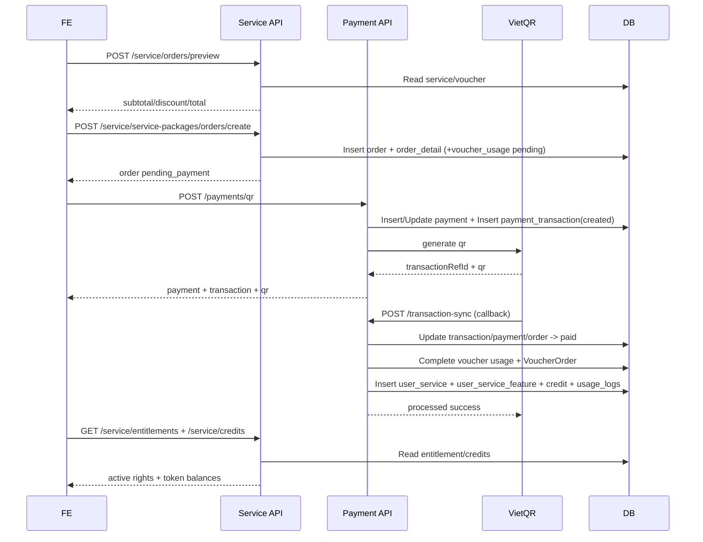

# Tài liệu flow API Subscription/Payment đã triển khai

## 1) Phạm vi tài liệu

Tài liệu này mô tả **đúng theo implementation hiện tại** của hệ thống tại BE:

- Danh sách endpoint và contract API.
- Payload/response mẫu.
- Thứ tự gọi API cho các luồng chính: đăng ký gói, mua thêm, mua lẻ theo tin, retry/cancel.
- Flow cập nhật dữ liệu DB (bảng nào ghi/đọc theo từng bước).

Base URL (service):

- `api/v1/service/...`

Base URL (payment):

- `api/v1/payments/qr`
- `vqr/bank/api/transaction-sync`

---

## 2) Bảng endpoint đã triển khai

### 2.1 Catalog + Pricing

- `GET api/v1/service/catalog`
  - Auth: optional
  - Mục đích: lấy catalog gói (`Service`) + pricing rules (`PricingRule`)
- `GET api/v1/service/service-packages/`
  - Auth: optional
  - Mục đích: lấy danh sách service package (hỗ trợ filter `type`, `target_type`)
- `GET api/v1/service/service-packages/{id}`
  - Auth: optional
  - Mục đích: chi tiết 1 gói

### 2.2 Order

- `POST api/v1/service/orders/preview`
  - Auth: required
  - Mục đích: preview server-side pricing + voucher validation
- `POST api/v1/service/service-packages/orders/create`
  - Auth: required
  - Mục đích: tạo order (idempotent theo `idempotency_key`)
- `GET api/v1/service/service-packages/orders/pending?service_id={id}&duration={n}`
  - Auth: required
  - Mục đích: tìm order pending gần nhất theo service + duration
- `GET api/v1/service/orders`
  - Auth: required
  - Mục đích: danh sách order của user (filter `status`)
- `GET api/v1/service/orders/{order_id}`
  - Auth: required
  - Mục đích: chi tiết order
- `POST api/v1/service/orders/{order_id}/retry`
  - Auth: required
  - Mục đích: thanh toán lại order `FAILED/EXPIRED`
- `POST api/v1/service/orders/{order_id}/cancel`
  - Auth: required
  - Mục đích: hủy order ở trạng thái cho phép

### 2.3 Payment

- `POST api/v1/payments/qr`
  - Auth: required
  - Mục đích: tạo/khởi tạo QR transaction cho order
- `POST vqr/bank/api/transaction-sync`
  - Auth: Bearer token VietQR (AllowAny ở DRF, xác thực token custom)
  - Mục đích: callback xác nhận thanh toán thành công

### 2.4 Entitlement + Credits + History

- `GET api/v1/service/entitlements`
  - Auth: required
  - Mục đích: lấy danh sách gói/quyền lợi đã cấp cho user
- `GET api/v1/service/credits`
  - Auth: required
  - Mục đích: lấy token/credit balance theo feature (`post/image/video/...`)
- `GET api/v1/service/transactions/history`
  - Auth: required
  - Mục đích: lịch sử transaction (transaction/payment/order status)
- `GET api/v1/service/payments/history`
  - Auth: required
  - Mục đích: alias của transaction history

### 2.5 Profile payable

- `GET api/v1/service/profile-payables`
  - Auth: required
  - Mục đích: lấy các profile update đã duyệt nhưng chưa thanh toán (`is_paid=False`)

---

## 3) Contract request/response

## 3.1 `POST /api/v1/service/orders/preview`

### Request payload

```json
{
  "service_id": 12,
  "quantity": 1,
  "duration": 1,
  "duration_unit": "month",
  "scope_type": "account",
  "target_type": "ACCOUNT",
  "target_id": null,
  "voucher_code": "VC-ABC123"
}
```

### Response mẫu (200)

```json
{
  "service": {
    "id": 12,
    "code": "PKG_VIP",
    "name": "Gói VIP",
    "price": "0.00",
    "duration": 1,
    "billing_unit": "month",
    "type": "VIP",
    "target_type": "ACCOUNT",
    "entitlement_mode": "credit_pool",
    "purchase_policy": "allow_parallel",
    "is_stackable": true,
    "features": [
      {
        "id": 201,
        "type": "image",
        "quantity": 0,
        "is_unlimited": true
      }
    ]
  },
  "quantity": 1,
  "duration": 1,
  "duration_unit": "month",
  "scope_type": "account",
  "target_type": "ACCOUNT",
  "target_id": null,
  "subtotal": "0.00",
  "discount_value": "0",
  "total_price": "0",
  "currency": "VND"
}
```

### Lỗi thường gặp

- `400`: voucher không hợp lệ/hết hạn/không đủ điều kiện.

---

## 3.2 `POST /api/v1/service/service-packages/orders/create`

### Request payload

```json
{
  "service_id": 12,
  "quantity": 1,
  "duration": 3,
  "duration_unit": "month",
  "scope_type": "account",
  "target_type": "ACCOUNT",
  "target_id": null,
  "voucher_code": "VC-ABC123",
  "idempotency_key": "ord-u123-20260317-001"
}
```

### Response mẫu (201)

```json
{
  "id": 8801,
  "code": "ORD26031700000123",
  "user": 99,
  "total_price": "500000.00",
  "currency": "VND",
  "status": "pending_payment",
  "payment_due_at": "2026-03-17T11:30:00Z",
  "canceled_reason": "",
  "order_details": [
    {
      "id": 12001,
      "service": 12,
      "service_name": "Gói VIP",
      "unit_price": "500000.00",
      "quantity": 1,
      "price": "500000.00",
      "duration": 3,
      "duration_unit": "month",
      "scope_type": "account",
      "target_type": "ACCOUNT",
      "target_id": null,
      "metadata": {}
    }
  ],
  "created_at": "2026-03-17T11:00:00Z",
  "updated_at": "2026-03-17T11:00:00Z"
}
```

### Idempotency

- Nếu gửi lại cùng `idempotency_key` + user:
  - trả về order cũ (200), không tạo order mới.

---

## 3.3 `POST /api/v1/payments/qr`

### Request payload

```json
{
  "order_id": 8801,
  "method": "vietqr"
}
```

### Response mẫu (200)

```json
{
  "payment": {
    "id": 501,
    "order_id": 8801,
    "method": "vietqr",
    "provider": "vietqr",
    "amount": "500000.00",
    "status": "created",
    "idempotency_key": null,
    "external_ref": null,
    "metadata": {},
    "created_at": "2026-03-17T11:01:00Z",
    "updated_at": "2026-03-17T11:01:00Z"
  },
  "transaction": {
    "id": 9001,
    "payment": 501,
    "transaction_ref_id": "VQR_TX_ABC",
    "qr_code": "...",
    "qr_link": "https://...",
    "img_id": "123",
    "bank_code": "VCB",
    "bank_account": "0123456789",
    "user_bank_name": "CONG TY ...",
    "amount": "500000.00",
    "status": "created",
    "idempotency_key": null,
    "metadata": {},
    "created_at": "2026-03-17T11:01:00Z",
    "updated_at": "2026-03-17T11:01:00Z"
  },
  "vietqr_raw": {
    "transactionRefId": "VQR_TX_ABC"
  }
}
```

### Lỗi thường gặp

- `404`: order không thuộc user hoặc không tồn tại.
- `502`: lỗi từ VietQR service.
- `400/500`: payload thiếu hoặc lỗi runtime.

---

## 3.4 `POST /api/v1/service/orders/{id}/retry`

### Request payload

```json
{
  "idempotency_key": "retry-u123-20260317-01"
}
```

### Response (200)

- Trả về `OrderServiceSerializer`.
- Order được chuyển lại `pending_payment`, set mới `payment_due_at`.

---

## 3.5 `POST /api/v1/service/orders/{id}/cancel`

### Request payload

```json
{
  "reason": "User canceled"
}
```

### Response (200)

- Trả về `OrderServiceSerializer`.
- Order chuyển trạng thái `canceled`.

---

## 3.6 `GET /api/v1/service/entitlements` và `GET /api/v1/service/credits`

### `entitlements` response rút gọn

```json
[
  {
    "id": 301,
    "service_name": "Gói VIP",
    "status": "active",
    "scope_type": "account",
    "scope_ref_id": null,
    "start_date": "2026-03-17T11:05:00Z",
    "end_date": "2026-04-16T11:05:00Z",
    "features": [
      {
        "feature_type": "image",
        "quantity_allocated": 0,
        "quantity_remaining": 0,
        "is_unlimited": true
      }
    ]
  }
]
```

### `credits` response rút gọn

```json
[
  {
    "id": 801,
    "feature_type": "post",
    "quantity_remaining": 50,
    "is_unlimited": false,
    "expires_at": "2026-04-16T11:05:00Z"
  },
  {
    "id": 802,
    "feature_type": "image",
    "quantity_remaining": 0,
    "is_unlimited": true,
    "expires_at": "2026-04-16T11:05:00Z"
  }
]
```

---

## 4) Flow nghiệp vụ đã triển khai (sequence + DB)

## 4.1 Luồng A: Đăng ký gói toàn account (global package)

Ví dụ: user mua `PKG_VIP`, áp dụng toàn tài khoản (`scope_type=account`).

### Thứ tự gọi API

1. `GET /api/v1/service/catalog`
2. `POST /api/v1/service/orders/preview`
3. `POST /api/v1/service/service-packages/orders/create`
4. `POST /api/v1/payments/qr`
5. VietQR callback `POST /vqr/bank/api/transaction-sync`
6. FE polling `GET /api/v1/service/entitlements` + `GET /api/v1/service/credits`

### Flow DB theo thứ tự

1. **Preview**
   - Read: `service_service`, `service_servicefeature`
   - Optional Read voucher: `voucher_voucher`, `voucher_voucherusage`
2. **Create order**
   - Insert: `service_orderservice` (status=`pending_payment`)
   - Insert: `service_orderdetailservice`
   - Optional Insert pending voucher: `voucher_voucherusage` (status=`pending`)
3. **Create QR**
   - Upsert-like payment selection:
     - Read latest `payment_payment` theo `order_id`
     - Insert/Update `payment_payment`
   - Insert `payment_paymenttransaction` (status=`created`)
4. **Callback thành công**
   - Update `payment_paymenttransaction` -> `paid`
   - Update `payment_payment` -> `paid`
   - Update `service_orderservice` -> `paid`
   - Nếu có voucher:
     - Update `voucher_voucherusage` pending -> completed
     - Insert `voucher_voucherorder` (nếu chưa có)
   - Cấp quyền lợi:
     - Insert `service_userservice`
     - Insert `service_userservicefeature`
     - Insert `service_usercreditbalance`
     - Insert `service_userserviceusagelogs` (`action=allocate`)

---

## 4.2 Luồng B: Mua thêm khi đang có gói (allow parallel)

Hệ thống hiện cho phép mua thêm song song theo `purchase_policy=allow_parallel`.

### Thứ tự gọi API

- Tương tự luồng A (preview -> create -> qr -> callback -> entitlements/credits).

### DB behavior quan trọng

- Khi callback paid:
  - `create_user_service_after_payment()` kiểm tra `existing_active`.
  - Nếu đã có gói cùng service đang active/scheduled:
    - `start_date` gói mới = `max(now, existing_active.end_date)`.
  - Kết quả: gói mới được xếp nối tiếp thời gian (stacked duration), không ghi đè gói cũ.

---

## 4.3 Luồng C: Mua lẻ áp dụng cho 1 tin/hồ sơ cụ thể

Áp dụng bằng cách truyền `scope_type` + `target_id` ở lúc create order:

- Theo tin: `scope_type="listing"`, `target_id={listing_id}`
- Theo hồ sơ: `scope_type="profile"`, `target_id={profile_update_request_id}`

### Payload ví dụ (mua lẻ cho 1 tin)

```json
{
  "service_id": 45,
  "quantity": 1,
  "duration": 1,
  "scope_type": "listing",
  "target_type": "CHO_Y_TE",
  "target_id": 99901
}
```

### DB traceability

- `service_orderdetailservice.scope_type`
- `service_orderdetailservice.target_type`
- `service_orderdetailservice.target_id`
- Sau paid:
  - `service_userservice.scope_type`
  - `service_userservice.scope_ref_id`

=> Có thể truy vết ngược từ entitlement/credit về đúng listing/profile đã mua.

---

## 4.4 Luồng D: Retry payment / Cancel order

### Retry

- Điều kiện: order ở `failed` hoặc `expired`.
- API: `POST /api/v1/service/orders/{id}/retry`
- DB:
  - Update `service_orderservice.status` -> `pending_payment`
  - Update `service_orderservice.payment_due_at`
  - Optional update `service_orderservice.idempotency_key`

### Cancel

- Điều kiện: order ở `draft/pending_payment/failed`.
- API: `POST /api/v1/service/orders/{id}/cancel`
- DB:
  - Update `service_orderservice.status` -> `canceled`
  - Update `service_orderservice.canceled_reason`

---

## 4.5 Luồng E: Profile update trả phí

### Thứ tự

1. `GET /api/v1/service/profile-payables` để lấy item hồ sơ chưa trả phí.
2. User tạo order với `scope_type=profile`, `target_id` trỏ vào request hồ sơ.
3. Payment flow như luồng A.
4. Callback gọi `mark_profile_updates_paid(order)`.

### DB cập nhật sau paid

- Doctor profile:
  - Update `doctor_doctorprofileupdaterequest.is_paid = true`
  - Update `doctor_doctorprofileupdaterequest.payment_status = PAID`
- Facility profile:
  - Update `facility_medicalfacilityprofileupdaterequest.is_paid = true`
  - Update `facility_medicalfacilityprofileupdaterequest.payment_status = PAID`

---

## 5) Flow kiểm tra token phía FE (đã triển khai)

Hiện BE cung cấp dữ liệu để FE quyết định chặn/mở hành vi:

1. FE gọi `GET /api/v1/service/credits`
2. FE lọc theo `feature_type` cần dùng (`post`, `image`, `video`, `posting_service`)
3. Rule check:
   - Nếu `is_unlimited=true` => luôn đủ token.
   - Nếu `is_unlimited=false` => check `quantity_remaining`.
4. Nếu thiếu token:
   - FE điều hướng user qua flow mua gói/mua lẻ.
   - FE có thể chọn `scope_type=account` (global) hoặc `scope_type=listing` (vừa đủ cho tin cụ thể).

Lưu ý hiện trạng:

- API consume token theo thao tác đăng bài chưa được expose trong module này.
- Module hiện cung cấp đầy đủ luồng **mua + cấp quyền + truy vấn balance/history**.

---

## 6) Sequence diagram tổng quát (đăng ký gói)



---

## 7) Mapping model <-> bảng DB (quy ước Django)

- `Service` -> `service_service`
- `ServiceFeature` -> `service_servicefeature`
- `PricingRule` -> `service_pricingrule`
- `OrderService` -> `service_orderservice`
- `OrderDetailService` -> `service_orderdetailservice`
- `UserService` -> `service_userservice`
- `UserServiceFeature` -> `service_userservicefeature`
- `UserCreditBalance` -> `service_usercreditbalance`
- `UserServiceUsageLogs` -> `service_userserviceusagelogs`
- `Payment` -> `payment_payment`
- `PaymentTransaction` -> `payment_paymenttransaction`
- `PaymentTransactionLog` -> `payment_paymenttransactionlog`
- `Voucher` -> `voucher_voucher`
- `VoucherUsage` -> `voucher_voucherusage`
- `VoucherOrder` -> `voucher_voucherorder`

---

## 8) Checklist dùng cho FE

- Trước khi mua: gọi `catalog` + `preview`.
- Tạo order: luôn gửi `idempotency_key`.
- Tạo QR: chỉ gọi khi order ở trạng thái payable.
- Poll/truy vấn:
  - `orders`, `orders/{id}` để theo dõi trạng thái đơn.
  - `transactions/history` để hiển thị lịch sử thanh toán.
  - `entitlements` + `credits` để hiển thị quyền lợi/tồn dư.
- Rule token:
  - Ưu tiên kiểm tra `is_unlimited`.
  - Nếu không unlimited thì dùng `quantity_remaining`.
