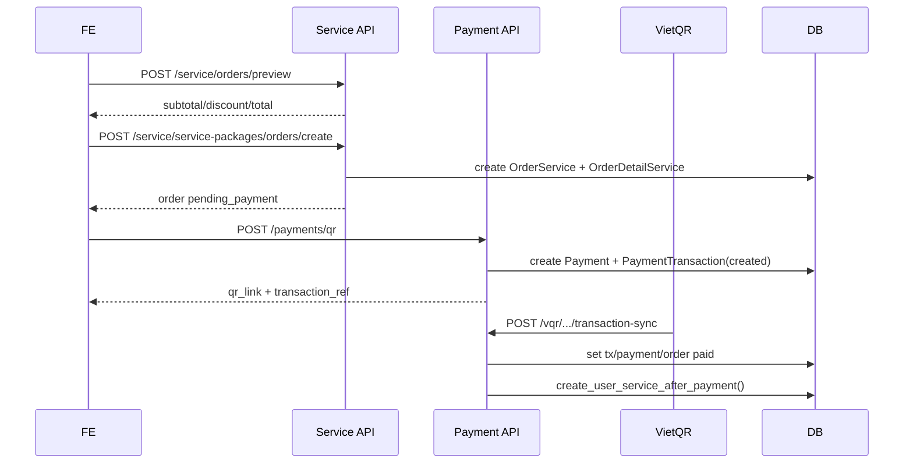
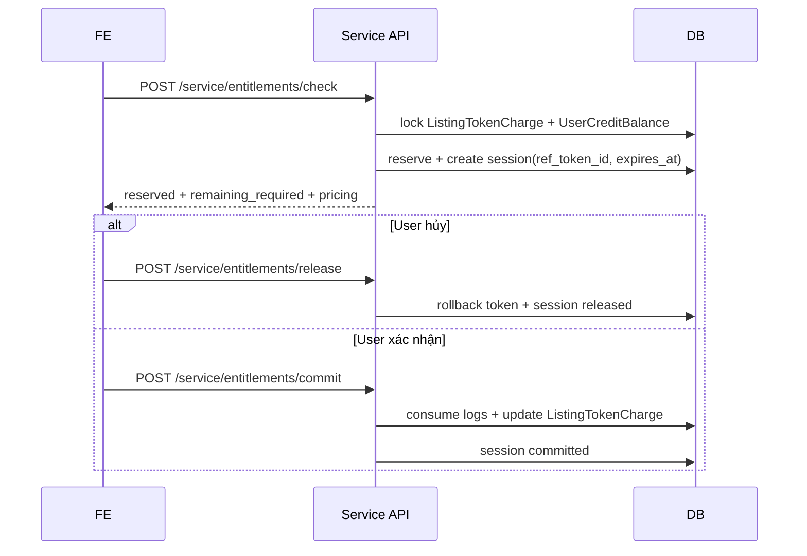

# Tài liệu API Subscription/Entitlement/Payment đã triển khai

## 1) Mục đích và phạm vi

Tài liệu này mô tả **đúng implementation hiện tại** của project cho phần Subscription:

* Danh sách endpoint API đang expose.
* Request/response thực tế theo serializer/service code.
* Sequence flow cho:

  * Mua gói dịch vụ.
  * Đăng tin mới (check/reserve/commit token).
  * Cập nhật tin đăng (không charge lại token đã trả).
* Quy tắc idempotency, TTL và các mã lỗi quan trọng.

Base path:

* Service: `api/v1/service/...`
* Payment: `api/v1/payments/...`
* VietQR callback/token: `vqr/...`

Tài liệu flow tổng quan nghiệp vụ: `BE/src/service/SUBSCRIPTION_SYSTEM_TECHNICAL_SPEC.md`.

---

## 2) Quy ước chung

### 2.1 Authentication

* Các endpoint service liên quan order/entitlement/credit: `IsAuthenticated`.
* Các endpoint catalog/public listing service: cho phép ẩn danh.
* Payment QR: `IsAuthenticated`.
* VietQR callback: `AllowAny`, xác thực bằng Bearer token HS512.

### 2.2 Unlimited token

* Hệ thống hiện tại dùng quy tắc:

  * `quantity_remaining = null` => unlimited.
* API `credits` và `entitlements` không còn field `is_unlimited`.

### 2.3 Pagination

* `GET /api/v1/service/orders`
* `GET /api/v1/service/transactions/history`
* `GET /api/v1/service/payments/history`

Sử dụng `LimitOffsetPagination` (có `count`, `next`, `previous`, `results`).

---

## 3) Bảng endpoint đã triển khai

## 3.1 Catalog/Pricing

| Method | Endpoint                                | Auth | Mô tả                              |
| ------ | --------------------------------------- | ---- | ---------------------------------- |
| GET    | `/api/v1/service/catalog`               | No   | Lấy catalog service + pricing rule |
| GET    | `/api/v1/service/service-packages/`     | No   | Lấy danh sách gói service          |
| GET    | `/api/v1/service/service-packages/{id}` | No   | Lấy chi tiết 1 gói                 |

## 3.2 Order

| Method | Endpoint                                          | Auth | Mô tả                                            |
| ------ | ------------------------------------------------- | ---- | ------------------------------------------------ |
| POST   | `/api/v1/service/orders/preview`                  | Yes  | Preview tổng tiền trước tạo order                |
| POST   | `/api/v1/service/service-packages/orders/create`  | Yes  | Tạo order pending_payment                        |
| GET    | `/api/v1/service/service-packages/orders/pending` | Yes  | Tìm pending order theo `service_id` + `duration` |
| GET    | `/api/v1/service/orders`                          | Yes  | Danh sách order của user                         |
| GET    | `/api/v1/service/orders/{order_id}`               | Yes  | Chi tiết order                                   |
| POST   | `/api/v1/service/orders/{order_id}/retry`         | Yes  | Retry order fail/expired                         |
| POST   | `/api/v1/service/orders/{order_id}/cancel`        | Yes  | Hủy order đúng trạng thái                        |

## 3.3 Entitlement/Credit/Profile payable

| Method | Endpoint                               | Auth | Mô tả                                     |
| ------ | -------------------------------------- | ---- | ----------------------------------------- |
| GET    | `/api/v1/service/entitlements`         | Yes  | Danh sách entitlement gói của user        |
| GET    | `/api/v1/service/credits`              | Yes  | Số dư token hiện tại                      |
| POST   | `/api/v1/service/entitlements/check`   | Yes  | Check + reserve token theo listing        |
| POST   | `/api/v1/service/entitlements/release` | Yes  | Release reservation                       |
| POST   | `/api/v1/service/entitlements/commit`  | Yes  | Commit reservation                        |
| GET    | `/api/v1/service/profile-payables`     | Yes  | Danh sách profile updates chưa thanh toán |

## 3.4 History

| Method | Endpoint                               | Auth | Mô tả                                     |
| ------ | -------------------------------------- | ---- | ----------------------------------------- |
| GET    | `/api/v1/service/transactions/history` | Yes  | Lịch sử giao dịch payment_transaction     |
| GET    | `/api/v1/service/payments/history`     | Yes  | Alias, cùng data như transactions/history |

## 3.5 Payment

| Method | Endpoint                                  | Auth              | Mô tả                                 |
| ------ | ----------------------------------------- | ----------------- | ------------------------------------- |
| POST   | `/api/v1/payments/qr`                     | Yes               | Tạo QR payment cho order              |
| POST   | `/vqr/api/token_generate`                 | No (Basic Auth)   | Sinh Bearer token cho callback VietQR |
| POST   | `/vqr/bank/api/transaction-sync`          | No (Bearer token) | Callback xác nhận thanh toán          |
| POST   | `/vqr/bank/api/test/transaction-callback` | No (Bearer token) | Alias test callback                   |

---

## 4) API chi tiết

## 4.1 GET `/api/v1/service/catalog`

### Mục đích

Lấy toàn bộ service đang active + pricing rules đang active.

### Response 200 (rút gọn)

```json
{
  "services": [
    {
      "id": 1,
      "code": "PKG_VIP",
      "name": "Gói VIP",
      "price": "300000.00",
      "duration": 1,
      "billing_unit": "month",
      "type": "VIP",
      "target_type": "CHO_DUOC_PHAM",
      "entitlement_mode": "credit_pool",
      "purchase_policy": "allow_parallel",
      "is_stackable": true,
      "features": [
        {
          "id": 10,
          "type": "image",
          "quantity": null,
          "description": "Hình ảnh đăng tải bổ sung",
          "reset_policy": "carry_over",
          "expires_with_entitlement": true,
          "extra_unit_price": null,
          "is_active": true
        }
      ]
    }
  ],
  "pricing_rules": [
    {
      "id": 100,
      "code": "EXTRA_IMAGE",
      "scope": "EXTRA_UNIT_PRICE",
      "target_type": "ACCOUNT",
      "cycle": "ONE_TIME",
      "amount": "500.00",
      "currency": "VND",
      "metadata": {},
      "is_active": true,
      "starts_at": "2026-03-18T08:00:00Z",
      "ends_at": null
    }
  ]
}
```

---

## 4.2 GET `/api/v1/service/service-packages/`

### Query params

* `type` (optional)
* `target_type` (optional)

### Response 200

Array `ServiceSerializer[]` (cấu trúc service tương tự trong `/catalog.services`).

---

## 4.3 GET `/api/v1/service/service-packages/{id}`

### Response 200

Một object `ServiceSerializer`.

### Lỗi

* 404 nếu service không tồn tại hoặc không active.

---

## 4.4 POST `/api/v1/service/orders/preview`

### Request body

```json
{
  "service_id": 1,
  "quantity": 1,
  "duration": 3,
  "duration_unit": "month",
  "scope_type": "account",
  "target_type": "ACCOUNT",
  "target_id": null,
  "voucher_code": "PROMO2026"
}
```

### Ghi chú input

* `price`: optional (giữ backward compatibility), server không tin giá từ FE.
* `quantity >= 1`, `duration >= 1`.

### Response 200 (rút gọn)

```json
{
  "service": { "...": "ServiceSerializer" },
  "quantity": 1,
  "duration": 3,
  "duration_unit": "month",
  "scope_type": "account",
  "target_type": "ACCOUNT",
  "target_id": null,
  "subtotal": "900000.00",
  "discount_value": "100000.00",
  "total_price": "800000.00",
  "currency": "VND"
}
```

### Lỗi 400

```json
{ "error": "Voucher không tồn tại" }
```

---

## 4.5 POST `/api/v1/service/service-packages/orders/create`

### Request body

```json
{
  "service_id": 1,
  "quantity": 1,
  "duration": 3,
  "duration_unit": "month",
  "scope_type": "account",
  "target_type": "ACCOUNT",
  "target_id": null,
  "voucher_code": "PROMO2026",
  "idempotency_key": "order-u123-20260318-01"
}
```

### Hành vi

* Nếu `idempotency_key` đã tồn tại cho user → trả lại order đã tạo trước đó (`200`).
* Nếu key mới → tạo order mới (`201`), status `pending_payment`.

### Response 201 (rút gọn)

```json
{
  "id": 501,
  "code": "ORD260318....",
  "user": 123,
  "total_price": "800000.00",
  "currency": "VND",
  "status": "pending_payment",
  "payment_due_at": "2026-03-18T10:30:00Z",
  "canceled_reason": "",
  "order_details": [
    {
      "id": 900,
      "service": 1,
      "service_name": "Gói VIP",
      "unit_price": "300000.00",
      "quantity": 1,
      "price": "900000.00",
      "duration": 3,
      "duration_unit": "month",
      "scope_type": "account",
      "target_type": "ACCOUNT",
      "target_id": null,
      "metadata": {}
    }
  ],
  "created_at": "2026-03-18T10:00:00Z",
  "updated_at": "2026-03-18T10:00:00Z"
}
```

### Lỗi 400

```json
{ "error": "Voucher không tồn tại" }
```

---

## 4.6 GET `/api/v1/service/service-packages/orders/pending`

### Query params bắt buộc

* `service_id`
* `duration`

### Response 200

Không tìm thấy:

```json
{ "order": null }
```

Tìm thấy:

```json
{ "order": { "...": "OrderServiceSerializer" } }
```

### Lỗi 400

```json
{ "error": "service_id is required" }
```

---

## 4.7 GET `/api/v1/service/orders`

### Query params

* `status` (optional)
* pagination: `limit`, `offset` (optional)

### Response 200

`LimitOffsetPagination` + `results` là `OrderServiceSerializer[]`.

---

## 4.8 GET `/api/v1/service/orders/{order_id}`

### Response 200

`OrderServiceSerializer`.

### Lỗi

* 404 nếu order không thuộc user.

---

## 4.9 POST `/api/v1/service/orders/{order_id}/retry`

### Request body

```json
{
  "idempotency_key": "retry-u123-20260318-01"
}
```

### Hành vi

* Chỉ retry được nếu order status là `failed` hoặc `expired`.
* Set lại:

  * `status = pending_payment`
  * `payment_due_at = now + 30m`
  * update `idempotency_key` nếu có truyền.

### Response 200

`OrderServiceSerializer`.

### Lỗi 400

```json
{ "error": "Order không ở trạng thái cho phép thanh toán lại" }
```

---

## 4.10 POST `/api/v1/service/orders/{order_id}/cancel`

### Request body

```json
{
  "reason": "User changed plan"
}
```

### Hành vi

* Chỉ hủy được nếu order status nằm trong:

  * `draft`, `pending_payment`, `failed`.

### Response 200

`OrderServiceSerializer` (status `canceled`, có `canceled_reason`).

### Lỗi 400

```json
{ "error": "Order không ở trạng thái cho phép hủy" }
```

---

## 4.11 GET `/api/v1/service/entitlements`

### Response 200

Array `UserServiceSerializer[]`.

Mỗi phần tử gồm:

* Thông tin gói: `service_name`, `status`, `start_date`, `end_date`, ...
* `features[]`:

  * `feature_type`
  * `quantity_allocated`
  * `quantity_remaining` (NULL => unlimited)
  * `expires_at`

---

## 4.12 GET `/api/v1/service/credits`

### Response 200

Array `UserCreditBalanceSerializer[]`.

```json
[
  {
    "id": 1,
    "feature_type": "image",
    "quantity_remaining": null,
    "expires_at": "2026-04-17T00:00:00Z"
  },
  {
    "id": 2,
    "feature_type": "video",
    "quantity_remaining": 12,
    "expires_at": "2026-04-17T00:00:00Z"
  }
]
```

---

## 4.13 POST `/api/v1/service/entitlements/check`

### Request body

```json
{
  "type": "CHO_DUOC_PHAM",
  "target": null,
  "listing_ref_type": "Medicine",
  "listing_ref_id": 1288,
  "post": 1,
  "image": 7,
  "video": 2,
  "reserve_tokens": true,
  "ref_token_id": "ref_abc_001"
}
```

### Hành vi core

1. Resolve target group/pricing target.
2. Lấy baseline đã charge theo listing (`ListingTokenCharge`).
3. Tính `requested_delta`.
4. Áp free quota (`ListingFreeTokenConfig`).
5. Reserve credit theo FEFO.
6. Tạo `EntitlementReservationSession` (nếu reserve=true), có `expires_at`.
7. Trả pricing fallback cho phần thiếu.

### Response 200 (rút gọn)

```json
{
  "ref_token_id": "ref_abc_001",
  "group_code": "MUABAN_CONGDONG",
  "session_status": "reserved",
  "expires_at": "2026-03-18T10:10:00Z",
  "free_token_profile": {
    "id": 3,
    "target_type": "CHO_DUOC_PHAM",
    "post_token": 1,
    "image_token": 3,
    "video_token": 0,
    "posting_service_token": 0
  },
  "charged_baseline": { "post": 1, "image": 5, "video": 0 },
  "requested": { "post": 1, "image": 7, "video": 2 },
  "requested_delta": { "post": 0, "image": 2, "video": 2 },
  "free_applied": { "post": 0, "image": 2, "video": 0 },
  "required_after_free": { "post": 0, "image": 0, "video": 2 },
  "reserved": { "post": 0, "image": 0, "video": 1 },
  "remaining_required": { "post": 0, "image": 0, "video": 1 },
  "consumption_plan": {
    "post": [],
    "image": [],
    "video": [
      {
        "credit_balance_id": 100,
        "source_user_service_feature_id": 801,
        "used": 1,
        "expires_at": "2026-04-17T00:00:00Z"
      }
    ]
  },
  "pricing": [
    {
      "feature_type": "video",
      "code": "EXTRA_VIDEO",
      "scope": "EXTRA_UNIT_PRICE",
      "target_type": "ACCOUNT",
      "cycle": "ONE_TIME",
      "currency": "VND",
      "quantity": 1,
      "unit_amount": "3000.00",
      "estimated_amount": "3000.00"
    }
  ],
  "total_estimated_extra": "3000.00",
  "pricing_target_type": "CHO_DUOC_PHAM"
}
```

### Lỗi 400 thường gặp

```json
{ "error": "ref_token_id đã thuộc user khác." }
```

```json
{ "error": "ref_token_id đã được dùng cho context khác." }
```

```json
{ "error": "ref_token_id đã được dùng với requested token khác." }
```

---

## 4.14 POST `/api/v1/service/entitlements/release`

### Request body

```json
{
  "ref_token_id": "ref_abc_001"
}
```

### Response 200

```json
{
  "ref_token_id": "ref_abc_001",
  "released": { "post": 0, "image": 0, "video": 1 },
  "released_log_count": 1
}
```

### Lỗi 400

```json
{ "error": "Phiên đã commit, không thể release." }
```

---

## 4.15 POST `/api/v1/service/entitlements/commit`

### Request body

```json
{
  "ref_token_id": "ref_abc_001"
}
```

### Hành vi

* Validate state machine.
* Tạo log `consume` từ reserve logs.
* Cập nhật `ListingTokenCharge` bằng `requested_delta`.
* Đánh dấu session `committed`.

### Response 200

```json
{
  "ref_token_id": "ref_abc_001",
  "consumed": { "post": 0, "image": 0, "video": 1 },
  "consumed_log_count": 1
}
```

### Lỗi 400

```json
{ "error": "Phiên đã release, không thể commit." }
```

```json
{ "error": "Phiên reserve đã hết hạn, vui lòng check lại." }
```

---

## 4.16 GET `/api/v1/service/profile-payables`

### Response 200

```json
{
  "doctor_profile_updates": [
    {
      "id": 11,
      "domain": "doctor_profile",
      "modification_type": "UPDATE",
      "updated_fields": ["services", "images"],
      "payment_status": "pending",
      "updated_at": "2026-03-18T09:00:00Z"
    }
  ],
  "facility_profile_updates": []
}
```

---

## 4.17 GET `/api/v1/service/transactions/history`

## 4.18 GET `/api/v1/service/payments/history`

Hai endpoint cùng dùng `TransactionHistoryView`.

### Query params

* `transaction_status`
* `payment_status`
* `order_status`
* `service_type`
* pagination (`limit`, `offset`)

### Response 200 (rút gọn)

```json
{
  "count": 1,
  "next": null,
  "previous": null,
  "results": [
    {
      "order_id": 501,
      "payment_id": 33,
      "transaction_id": 78,
      "transaction_ref_id": "VQR-...",
      "service_id": 1,
      "service_name": "Gói VIP",
      "service_type": "VIP",
      "registered_at": "2026-03-18T10:00:00Z",
      "expires_at": "2026-04-17T10:00:00Z",
      "duration": 1,
      "amount": "300000.00",
      "method": "vietqr",
      "transaction_status": "paid",
      "payment_status": "paid",
      "order_status": "paid"
    }
  ]
}
```

---

## 4.19 POST `/api/v1/payments/qr`

### Request body

```json
{
  "order_id": 501,
  "method": "vietqr"
}
```

### Response 200 (rút gọn)

```json
{
  "payment": {
    "id": 33,
    "order_id": 501,
    "method": "vietqr",
    "provider": "vietqr",
    "amount": "300000.00",
    "status": "pending",
    "idempotency_key": null,
    "external_ref": null,
    "metadata": {},
    "created_at": "2026-03-18T10:02:00Z",
    "updated_at": "2026-03-18T10:02:00Z"
  },
  "transaction": {
    "id": 78,
    "payment": 33,
    "transaction_ref_id": "VQR-...",
    "qr_code": "000201...",
    "qr_link": "https://img.vietqr.io/...",
    "img_id": "xxx",
    "bank_code": "VCB",
    "bank_account": "123456789",
    "user_bank_name": "KHAMBENH",
    "amount": "300000.00",
    "status": "created",
    "idempotency_key": null,
    "metadata": {},
    "created_at": "2026-03-18T10:02:00Z",
    "updated_at": "2026-03-18T10:02:00Z"
  },
  "vietqr_raw": { "...": "raw from provider" }
}
```

### Lỗi thường gặp

* 400: thiếu `order_id` hoặc `method`.
* 404: order không tồn tại/không thuộc user.
* 502: VietQR service lỗi.

---

## 4.20 POST `/vqr/api/token_generate`

### Header

* `Authorization: Basic base64(username:password)`

### Response 200

```json
{
  "access_token": "<jwt-hs512>",
  "token_type": "Bearer",
  "expires_in": 300
}
```

### Lỗi

* 400 header sai format.
* 401 credentials sai.

---

## 4.21 POST `/vqr/bank/api/transaction-sync`

### Header

* `Authorization: Bearer <token-tu-vqr-api-token-generate>`

### Body (rút gọn)

```json
{
  "orderId": 501,
  "amount": "300000",
  "content": "THANH TOAN ...",
  "urlLink": "https://...",
  "serviceCode": "VCB",
  "bankaccount": "123456789",
  "terminalCode": "terminal-1",
  "subTerminalCode": "sub-1"
}
```

### Hành vi

* Validate bearer token.
* Tìm `Payment` theo `orderId`.
* Tìm transaction khớp `content`, status `created|paid`.
* Nếu đã `paid`: trả success idempotent.
* Nếu `created`:

  * update `PaymentTransaction.status = paid`
  * update `Payment.status = paid`
  * update `OrderService.status = paid`
  * tạo `UserService`/`UserCreditBalance` qua `create_user_service_after_payment`
  * mark profile update paid (nếu có)
  * complete voucher usage (nếu có)

### Response 200

```json
{
  "error": false,
  "errorReason": null,
  "toastMessage": "Transaction processed successfully",
  "object": {
    "reftransactionid": "VQR-..."
  }
}
```

### Lỗi thường gặp

* 401 token invalid/expired.
* 400 thiếu `orderId`, hoặc không có transaction match.

---

## 5) Sequence flow thực tế đã triển khai

## 5.1 Flow A - Mua gói dịch vụ



## 5.2 Flow B - Đăng tin mới có reserve token



## 5.3 Flow C - Cập nhật tin đăng (media)

```mermaid
flowchart TD
    A[User cập nhật số image/video của listing] --> B[POST entitlements/check]
    B --> C[Đọc charged_baseline từ ListingTokenCharge]
    C --> D[Tính requested_delta = max(requested - baseline, 0)]
    D --> E[Áp free quota + reserve credit FEFO]
    E --> F{Còn thiếu token?}
    F -- Có --> G[Trả pricing fallback để user thanh toán thêm]
    F -- Không --> H[Chờ commit]
    G --> H
    H --> I[POST entitlements/commit]
    I --> J[Update ListingTokenCharge += requested_delta]
```

Kết quả:

* Không charge lại token đã trả trước đó.
* Chỉ charge phần tăng mới.

---

## 6) Quy tắc idempotency và TTL

### 6.1 Order

* `create_order` idempotent theo `idempotency_key` (scope theo user).

### 6.2 Entitlement

* `ref_token_id` là key của 1 reservation session.
* Retry `check` cùng `ref_token_id` + cùng context/requested → trả session cũ.
* Session có TTL (`expires_at`), commit sau hết hạn → reject.
* Job release session hết hạn:

  * `python manage.py release_expired_entitlement_sessions --limit 500`

---

## 7) Error mapping nhanh

| Endpoint                        | HTTP | Ví dụ                       |
| ------------------------------- | ---- | --------------------------- |
| `/service/orders/preview`       | 400  | voucher không hợp lệ        |
| `/service/orders/{id}/retry`    | 400  | order không retry được      |
| `/service/orders/{id}/cancel`   | 400  | order không hủy được        |
| `/service/entitlements/check`   | 400  | ref_token_id khác context   |
| `/service/entitlements/release` | 400  | session đã committed        |
| `/service/entitlements/commit`  | 400  | session đã released/hết TTL |
| `/payments/qr`                  | 404  | order không thuộc user      |
| `/vqr/.../transaction-sync`     | 401  | token không hợp lệ          |

---

## 8) Ghi chú cho FE/QA

* FE cần check credit theo:

  * `quantity_remaining == null` => unlimited.
  * nếu có giá trị số → số token còn lại.
* Khi listing edit:

  * luôn truyền `listing_ref_type` + `listing_ref_id` để backend tính baseline đúng.
* Luồng đúng:

  * check → (payment nếu cần) → commit.
  * hủy bỏ → release.
